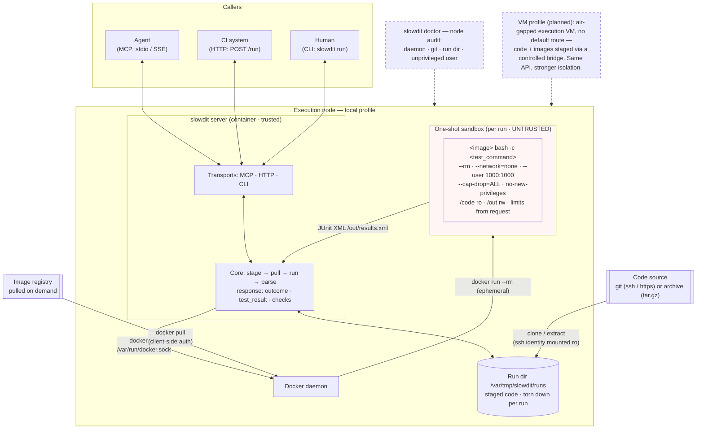

# slowdit

An MCP server for executing untrusted code in a (semi-)isolated environment.
This tool runs code (usually a test suite for a specific commit) inside a throwaway Docker container, optionally isolated in a VM (WIP). 

## Architecture



Trusted boundary: the server and the daemon. The per-run sandbox never sees
the docker socket, the ssh identity, or any network; dashed boxes are
audits and the planned VM profile.

## Main use case

`slowdit` defines a standard contract for executing code by requiring: 

- Source code (git URL, archive, SHA)
- Environment for code execution (Docker image)
- Entry point (optional) for executing scripts from the source, e.g. `scripts/run_tests.sh --junitxml=/out/results.xml`

The code is run on the execution target: either a Docker container on the `slowdit` server or a container on a VM (WIP). 
Because the layered infrastructure creates additional failure modes, the `RunResponse` output contains multiple layers: 

- `Outcome` indicates whether execution completed successfully
- `TestResult` contains (optional) test outputs, e.g. JUnit counts
- `Check` asserts whether security boundaries were upheld 

When agents execute untrusted code, they need to have access to test results to be able to identify and solve bugs. 
By default, test results come back as JUnit XML and can be directly integrated in other CI systems; this means CI systems and agents can use the same API. 

If bugs are caused by infrastructure configuration (e.g. some commands requiring root access, a new dependency needing to be installed, a missing API key), that may require a more thorough review.
The `slowdit` setup ensures that agents cannot (as) easily solve these problems by breaking security boundaries on your machine. 
Clearly defined outputs make it possible to set up appropriate alert mechanisms for escalation. 


## Isolation model

- The execution host runs Docker containers as an unprivileged user without a root-equivalent path or sudo
- Each run uses a one-shot container without network capabilities, with code mounted as read-only

While running code in a Docker image is safer than running it directly on the host, this can still be vulnerable to privilege escalation. 
Additionally, Docker has some (convenient) features which are not compatible with network hardening techniques. 

For this reason, a VM profile is in development: 

- The execution host becomes an air-gapped VM without a default route
- The `slowdit` server uses a controlled bridge to stage Docker images and source code
- The execution host does not share a network with the rest of the stack

The `slowdit` API makes it easier to maintain and audit infrastructure for sandboxed code execution. Same API, stronger isolation. 

## Deployment

Currently, only the local profile is supported. 
Both profiles (local and VM) will use the same API. 

## Local profile 

Because the execution host runs the `slowdit` server as well as the Docker containers, it needs more resources compared to the VM profile. Resource requirements depend entirely on the code being tested, as well as the number of concurrent runs. The profile below will suffice for light-weight Docker images when concurrency is limited. 

| | |
|---|---|
| vCPU | 2 |
| RAM | 4 GB |
| Disk | 32 GB |
| OS | Any modern 64-bit Linux (tested with Ubuntu 26.04) |
| Network | Outbound internet — images are pulled on demand |

#### Install and deploy 

The `slowdit` server needs Docker Engine and a git identity that allows access to the source code.
Additionally, if you use a private Docker image registry for seed images, you will need to run `docker login`.  


```bash
git clone https://github.com/ramellose/slowdit.git
cd slowdit
./scripts/deploy.sh
```

The deployment script does the following: 

- Checks access to prerequisites, e.g. docker-out-of-docker and SSH (if not disabled)
- Builds and deploys the `slowdit` server image
- Verifies server status through `/health` endpoint and `slowdit doctor` 

Other options can be set through optional env vars, see `.env.example`. 

To run directly: `pip install .` (Python ≥ 3.12), then `slowdit doctor` and `slowdit serve --http --port 8080`.

### Checks

On deployment, some health checks are already run. They can be rerun manually. 
The second check runs `slowdit`'s own test suite through its own sandbox: it confirms the node can stage (private) source code via git and run it in a Docker image. 

```bash
curl -s localhost:8080/health
# {"status": "ok", "version": "0.1.0", "profile": "local", "docker": true, ...}

curl -s -X POST localhost:8080/run -H 'content-type: application/json' -d '{
  "image": "slowdit:latest",
  "code": {"git": {"url": "ssh://git@github.com/ramellose/slowdit.git", "ref": "main"}}
}'
```

If `slowdit` returns `"outcome": "completed"`, that means the node is healthy and runs the requested source code in the requested Docker image. This does not mean the tests completed successfully; that is included in `"test_result"` and depends on the caller's request. 

### Toy example

This minimal example shows how the `slowdit` contract works. 

**MCP path** - this starts a `slowdit` MCP subprocess the same way that an agent harness would. 

```bash
docker exec slowdit python /app/examples/toy.py
```

**HTTP path** — the same core, the way CI would call it:

```bash
mkdir -p /tmp/toy/scripts && cat > /tmp/toy/scripts/run_tests.sh <<'EOF'
#!/bin/sh
cat > /out/results.xml <<'XML'
<?xml version="1.0"?>
<testsuite name="toy" tests="2" failures="1" errors="0" skipped="0" time="0.01">
  <testcase name="starts" classname="toy" time="0.001"/>
  <testcase name="fails_on_purpose" classname="toy" time="0.001">
    <failure message="intentional">boom</failure>
  </testcase>
</testsuite>
XML
EOF
CODE_B64=$(tar -cz -C /tmp/toy scripts | base64 -w0)
curl -s -X POST localhost:8080/run -H 'content-type: application/json' \
  -d "{\"image\":\"docker.io/library/debian:bookworm-slim\",\"code\":{\"archive\":\"$CODE_B64\"},\"test_command\":\"sh scripts/run_tests.sh --junitxml=/out/results.xml\"}" \
  | python3 -m json.tool
```

This is the structure of the output: 

```
{
    "run_id": "20260907T152940-32f6e1ed",
    "image": "docker.io/library/debian:bookworm-slim",
    "resolved_ref": null,
    "outcome": "completed",
    "exit_code": 0,
    "started_at": "2026-09-07T15:29:40.000820Z",
    "finished_at": "2026-09-07T15:29:41.671448Z",
    "duration_seconds": 1.670628,
    "detail": null,
    "test_result": {
        "total": 2,
        "failures": 1,
        "errors": 0,
        "skipped": 0,
        "duration_seconds": 0.01,
        "failing": [
            {
                "nodeid": "toy::fails_on_purpose",
                "message": "intentional",
                "kind": "failure"
            }
        ]
    },
    "checks": [
        {
            "name": "network_isolated",
            "ok": true,
            "detail": "invocation used --network=none"
        },
        {
            "name": "unprivileged_user",
            "ok": true,
            "detail": "invocation used --user 1000:1000"
        },
        {
            "name": "no_privilege_escalation",
            "ok": true,
            "detail": "--cap-drop=ALL --security-opt=no-new-privileges:true --read-only"
        },
        {
            "name": "mounts_in_scope",
            "ok": true,
            "detail": "code at /code:ro; writable: /out (results), /tmp (bounded tmpfs)"
        },
        {
            "name": "limits_applied",
            "ok": true,
            "detail": "timeout 300s (memory none, cpus none)"
        },
        {
            "name": "duration",
            "ok": true,
            "detail": "1.7s elapsed (exit 0)"
        }
    ]
}

```

The JUnit XML is included as is; everything else contains information about orchestration failure(s), test duration and audit results. 

## VM profile (planned)

The execution host is an air-gapped VM with no default route: code is
staged across a controlled bridge and images are imported offline by a sync
tool, so the sandbox never shares a network with the rest of the stack.
The API reports which images the node can actually run and answers
`image_unavailable` instead of failing obscurely when one is missing.

## Transports

- **MCP** — for agents.
- **HTTP** (`POST /run`) — for CI systems. Synchronous for now: the request
  stays open for the duration of the run. The HTTP status reports the health
  of the webhook, not the tests — pass/fail lives in the body.
- **CLI** — for humans and test plans: `slowdit run --image … --git … --test-cmd …`.

## Planned features

Working definitions for these live in [docs/design-notes.md](docs/design-notes.md).

- VM profile 
- Credential consumption contract
- Network monitoring
- Pre-execution security analysis

# AI disclaimer

The initial design and workflows were manually developed with a bespoke VM setup and a self-hosted Forgejo server; refactoring to improve usability and portability was done using Qwen 3.8 27B running on a local machine. 
